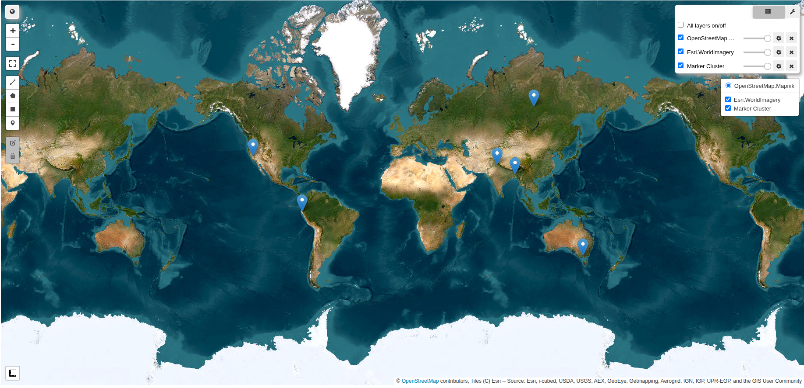

# Farm Guardians: NASA Agro Challenge 🚜🌿

**Farm Guardians** es un MVP educativo desarrollado para la [NASA Space Apps Challenge 2025](https://www.spaceappschallenge.org/2025/challenges/nasa-farm-navigators-using-nasa-data-exploration-in-agriculture/).  
Convierte datos satelitales de **NASA** en un videojuego donde los jugadores equilibran productividad y sostenibilidad agrícola.

**Equipo:** Todo está acá 👉🧠👈  
**Integrantes:**  
- Gutierrez Vilca, Henry Williams  
- Nieto Barrientos, Yishar Piero   
- Ochoa Barrios, Jesús Gustavo  
- Pachari Lipa, Milton Alexis  
- Puma Huamani, Glina de la Flor  

---

## Resumen
Más de **300 millones de pequeños agricultores** carecen de acceso a servicios digitales de información climática (WRI). Esto los deja vulnerables ante sequías, heladas y olas de calor.  

**Farm Guardians** busca cerrar esa brecha: un videojuego que traduce datos de satélite como **NDVI, temperatura y precipitación** en misiones interactivas donde los jugadores toman decisiones de **riego, fertilización y rotación de cultivos**.  

El objetivo: **aprender jugando cómo anticipar desafíos climáticos y proteger los cultivos**.  
Disponible en **VR y dispositivos convencionales**.  

---

## 🎥 / 🌐 Demostración & Visualización

- [Video demostración](https://www.youtube.com/watch?v=3FlgNu1J8EA)  
- [Repositorio GitHub](https://github.com/iAmMazapan/FarmGuardians)  
- **Features del juego:** [Farm Guardians Web](https://gillyphuu.github.io/NASA-FarmGuardians/)  

---

## 🎮 Mecánicas del Juego
- Mantener tres indicadores: **vigor del cultivo, humedad del suelo, salud del suelo**  
- Escenarios climáticos reales: sequías, lluvias intensas, olas de calor  
- Progresión:
  - **Inicio (Semanas 1–3):** tutorial y decisiones simples  
  - **Medio (Semanas 4–6):** eventos climáticos reales  
  - **Final (Semanas 7–9):** autonomía con múltiples variables  

---

## 📊 Datos NASA
| Fuente | Variables | Uso |
|--------|-----------|-----|
| NASA POWER | Temperatura, lluvia | Condiciones semanales |
| MODIS/VIIRS (NDVI) | Vigor vegetal | Salud inicial |
| SMAP (opcional) | Humedad | Valor base |
| ECOSTRESS (opcional) | Evapotranspiración | Ajustes dinámicos |

---

## 🌪️ Fenómenos Climáticos en el Juego

| Fenómeno | Región / País | Fechas | Descripción |
|----------|----------------|--------|-------------|
| Sequía extrema | California, EE. UU. (Valle Central) | 2014-07 → 2015-06 | Sequía prolongada con impacto agrícola e incendios |
| Calor extremo | Australia (Victoria) | 2019-03 → 2020-02 | Ola de calor récord con estrés en cultivos |
| Plagas agrícolas | India (Punjab) | 2019-12 → 2020-11 | Brotes de langostas afectando trigo |
| Precipitaciones intensas | Bangladesh (Delta del Ganges) | 2016-12 → 2017-11 | Inundaciones monzónicas sobre arrozales |
| Heladas / Frío extremo | Siberia, Rusia | 2017-07 → 2018-06 | Heladas severas que afectaron cultivos |
| El Niño / Lluvias intensas | Perú (Costa norte – Piura) | 2016-07 → 2017-06 | Lluvias extremas e inundaciones agrícolas |



---

## 🔄 Pipeline de Datos
1. Conectar a APIs de NASA (GEE, POWER)  
2. Seleccionar región y fechas  
3. Descargar datos (NDVI, T2M, PRECTOT)  
4. Procesar y limpiar (resample semanal)  
5. Calcular indicadores (ΔNDVI, lluvia acumulada, temperatura)  
6. Exportar a **JSON** para integración con el juego  

---

## 🗂️ Estructura del Proyecto

```text
FarmGuardians/
│
├─ UnityProject/            # Proyecto Unity (VR + UI + mecánicas)
│   ├─ Assets/
│   ├─ Scenes/
│   ├─ Scripts/
│   └─ UI/
│
├─ DataIntegrator/          # Módulo de datos NASA
│   ├─ ColabNotebooks/      # Prototipos y pipelines
│   │   └─ nasa_data.ipynb
│   ├─ raw_data/            # Datos crudos
│   ├─ processed_data/      # Datos procesados (JSON)
│   ├─ utils.py
│   └─ requirements.txt
│
└─ README.md
